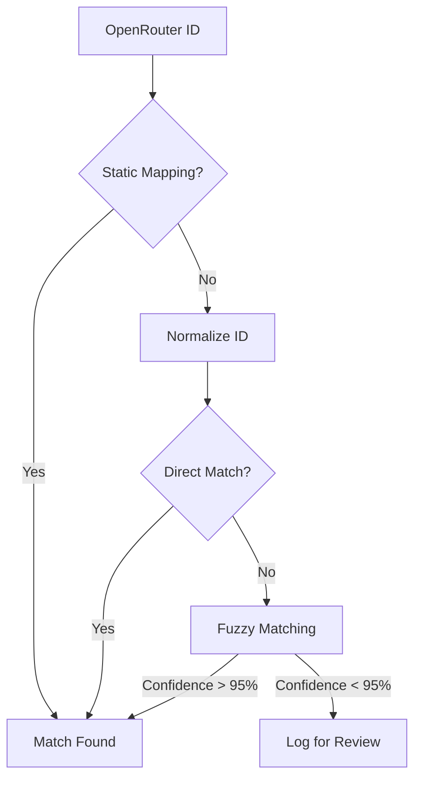

# 03 - LLMIndex: Matching Engine

## The Challenge
**OpenRouter** and **ArtificialAnalysis** use different naming conventions for the same models.
- **OpenRouter**: `anthropic/claude-3.5-sonnet`
- **ArtificialAnalysis**: `claude-3.5-sonnet` or `claude-3-5-sonnet`

The **Matching Engine** is responsible for ensuring data integrity during the merge stage.

## Strategy (Multi-Tier)

### Tier 1: Deterministic Mapping (`static_mapping.json`)
A hard-coded configuration file for complex cases that are impossible to match automatically.
```json
{
  "openai/gpt-4o-2024-05-13": "gpt-4o",
  "google/gemini-pro-1.5": "gemini-1.5-pro"
}
```

### Tier 2: Normalization Rules
Before matching, both IDs are cleaned:
1.  **Strip Provider**: Remove `openai/`, `anthropic/`, etc.
2.  **Lowercase**: `GPT-4` becomes `gpt-4`.
3.  **Alpha-Numeric**: Replace spaces, dots, and slashes with dashes.
4.  **Version Stripping**: Remove date suffixes (e.g., `-20240513`) for base model comparison.

### Tier 3: Fuzzy Matching (Levenshtein)
If no direct match is found after normalization:
1.  Calculate **Levenshtein Distance** between the cleaned OpenRouter ID and all known ArtificialAnalysis models.
2.  **Threshold**: Match only if confidence is > 95%.
3.  **Validation**: If confidence is between 85% and 94%, it's logged as "Potential Match" for human manual review.

## Pipeline Integration


## Review Process
The matching failures are stored in `matching_failures.log`. For an Open Source project, users can contribute by adding missing mappings to the repository via PR.
